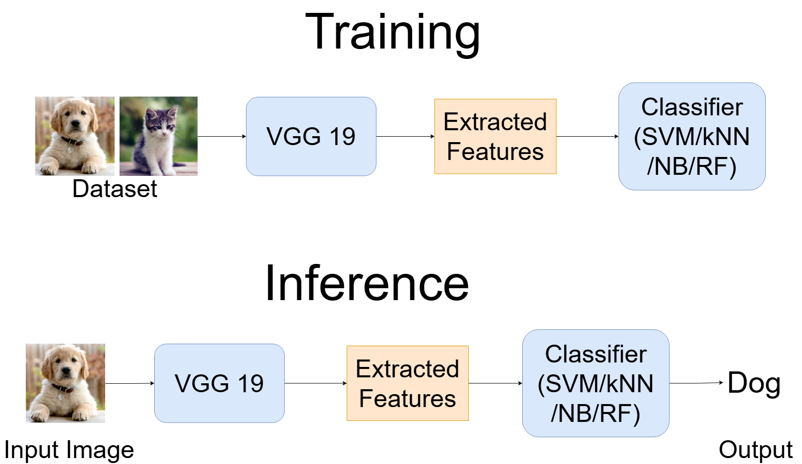
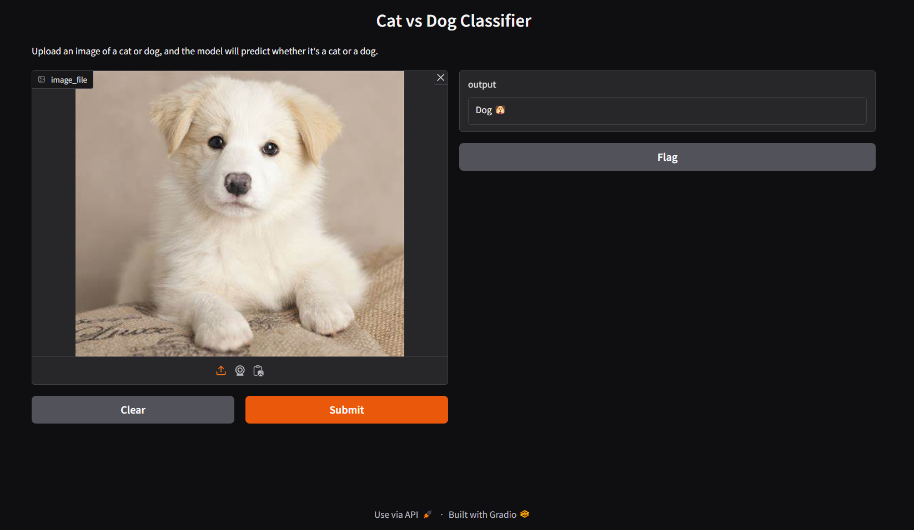

# **Dog Cat Classfication**
## **Pipeline**

### **Training**
- Utilizing VGG 19 for feature extraction, flatten the feature map to vector.
- Training SVM classifier with kernel rbf with default C.
- Try with others models such as kNN with k=3, Gaussian Naive Bayes and Random Forest.

### **Inference**
- Input image is fed into VGG 19 to extract feature.
- Then using trained classifier (SVM/kNN/NB/RF) to generate output.

### **Training result**
- SVM have highest score with 0.99 for all metrics (Accuracy, Precision, Recall, F1 score).

## **Installation**
```
cd Exercise1–Image classification
pip install -r requirements.txt
```
Download [trained SVM model](https://drive.google.com/file/d/1DmCIP2H4S54RxekKLzhC6K5hx05ssvpe/view?usp=sharing)

I use Gradio for demo. To run inference,
```
python inference.py
```
Then interact with UI.
